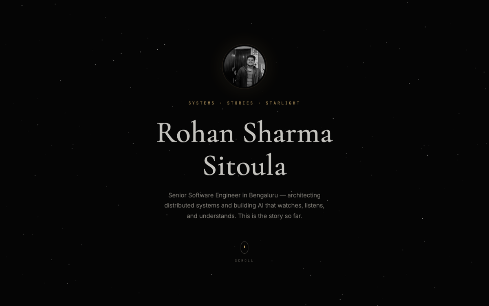

# Rohan Sharma Sitoula

**`systems · stories · starlight`**

Senior Software Engineer in Bengaluru — architecting distributed systems 
and building AI that watches, listens, and understands.

**[✦ Read the full story →](https://rohansharmasitoula.github.io/rohansharmasitoula/)**

 

| `1M+` | `90%` | `1` | `3+` |
|:---:|:---:|:---:|:---:|
| annual sessions | human parity · AI proctor | patent | years shipping |

---

### The story so far

- 🏛 **The Architect** *(2026 — present)* — Led design of 8 core microservices on Temporal & AWS Lambda with tenant federation, multi-region deployments, and database sharding. ADRs across squads, CI/CD review tooling (−35% turnaround), lowest SLA breach rate on the team for Fortune 500 clients.
- 👁 **The Machine That Watches** *(2025 – 2026)* — Spearheaded **Alvy**, a patented multimodal agentic AI proctor reaching **90% human parity** in malpractice detection. Scaled live proctoring past **1M+ sessions/year** on Twilio, LiveKit & Azure Communication Services.
- ⚡ **Scale** *(2023 – 2025)* — Event-driven microservices (Node.js, Kafka, Temporal, GraphQL) under 5,000+ concurrent exam sessions; integrations with 5 global LMS platforms; a transcoding service that cut composition costs 20%.
- 🌱 **First Light** *(2023)* — REST → GraphQL (−40% latency), Sentry tracing (−50% triage time), test coverage 40% → 75%.

### Instruments of the trade

### In the margins

- 📦 [**blocknote-py**](https://pypi.org/project/blocknote-py/) — open-source Python library for BlockNote documents · 3,000+ downloads
- 📄 *Fine-Grained Classification for Emotion Detection Using Advanced Neural Models and GoEmotions Dataset* — Journal of Soft Computing and Data Mining, 2024

*The next chapter is unwritten.*

[email](mailto:sitoularohansharma@gmail.com) · [linkedin](https://www.linkedin.com/in/rohansharmasitoula)

